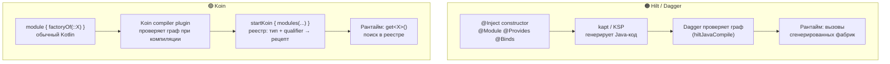
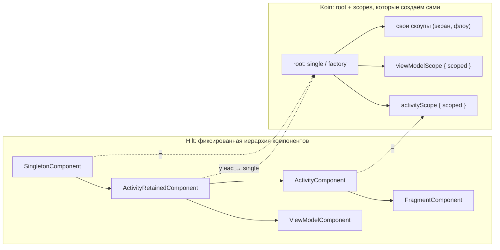

## 3. Hilt vs Koin: базовые различия (4 мин)

**Главная мысль:** Hilt — это **кодогенерация**: граф собирается и проверяется при сборке, а в рантайме работают сгенерированные фабрики. Koin — это **реестр в рантайме**: модули на Kotlin DSL кладут в контейнер «рецепты», а `get()` достаёт их по типу. Полноту графа у нас проверяет Koin compiler plugin при компиляции.

### 3.1. Как это работает под капотом



| | Hilt | Koin |
|---|---|---|
| Что это | Аннотации + кодогенерация | Kotlin DSL + сервис-локатор |
| Где собирается граф | При сборке (kapt/KSP + Dagger) | При старте (`startKoin`) |
| Проверка графа | Dagger на этапе `hiltJavaCompile` | Koin compiler plugin при компиляции модуля |
| Скорость сборки | Долгая: kapt/KSP и генерация в каждом модуле | Генерации нет, DSL — обычный Kotlin |
| Как находит зависимость | Прямой вызов сгенерированной фабрики | Поиск по `KClass` (+ qualifier) в реестре |
| Регистрация модулей | Автоматически через `@InstallIn` | Вручную: модуль добавляем в список (`FeatureDiModules.kt`) |
| KMP | Нет (только JVM/Android) | Да: общий код с iOS |

### 3.2. Один и тот же модуль: side-by-side

```kotlin
// ───────────── Hilt ─────────────
class FeatureRepositoryImpl @Inject constructor(
    private val api: FeatureApi,
    @ApplicationContext private val context: Context,
    private val httpRequestBuilder: Provider<HttpRequestBuilder>,
) : FeatureRepository

class GetFeatureUseCase @Inject constructor(
    private val repository: FeatureRepository,
)

@Module
@InstallIn(SingletonComponent::class)
internal interface FeatureDataModule {
    @Binds @Singleton
    fun bindRepository(impl: FeatureRepositoryImpl): FeatureRepository

    companion object {
        @Provides
        fun provideApi(@RetrofitQualifier(RetrofitType.PAYCOM) retrofit: Retrofit): FeatureApi =
            retrofit.create()
    }
}
// GetFeatureUseCase Hilt находит сам — по @Inject
```

```kotlin
// ───────────── Koin ─────────────
class FeatureRepositoryImpl(                       // без @Inject и аннотаций
    private val api: FeatureApi,
    private val context: Context,                  // без @ApplicationContext
    private val httpRequestBuilder: () -> HttpRequestBuilder,  // вместо Provider<T>
) : FeatureRepository

class GetFeatureUseCase(
    private val repository: FeatureRepository,
)

val featureDataModule = module {
    factory<FeatureApi> { get<Retrofit>(named(RetrofitType.PAYCOM)).create() }
    single {
        FeatureRepositoryImpl(
            api = get(),
            context = get(),
            httpRequestBuilder = { get() },
        )
    } bind FeatureRepository::class
}

val featureDomainModule = module {
    factoryOf(::GetFeatureUseCase)                 // Koin сам ничего не находит — объявляем явно
}
```

### 3.3. Шпаргалка соответствий

| Задача | Hilt | Koin |
|---|---|---|
| Модуль | `@Module @InstallIn(...)` | `val x = module { }` |
| Новый экземпляр на каждый запрос | без скоупа | `factory` / `factoryOf` |
| Один на приложение | `@Singleton` | `single` / `singleOf` |
| Интерфейс → реализация | `@Binds` | `singleOf(::Impl) bind Iface::class` |
| Ручная сборка | `@Provides` | `single { X(a = get()) }` |
| Qualifier | `@Named("x")` / свой `@Qualifier` | `named("x")` |
| Context | `@ApplicationContext` | `androidContext()` → просто `Context` |
| Ленивое получение | `Provider<T>` / `dagger.Lazy<T>` | `() -> T` / `Lazy<T>` |
| Поле в Activity | `@AndroidEntryPoint` + `@Inject lateinit var` | `by inject()` |
| ViewModel | `@HiltViewModel` + `hiltViewModel()` | `viewModelOf(::Vm)` + `koinViewModel()` |
| Runtime-параметры | `@AssistedInject` + `@AssistedFactory` | `koinViewModel { parametersOf(id) }` |
| Скоуп экрана/Activity | `ActivityComponent`, `@ActivityScoped` | `activityScope { scoped { } }` |
| Коллекции | `@IntoSet` / `@IntoMap` | `bind Iface::class` + `getAll<Iface>()` |

### 3.4. Скоупы: компоненты Hilt vs scopes Koin



Для Data/Domain нужны только `single` и `factory`. Скоупы понадобятся на этапе Presentation.

### 3.5. Что важно запомнить при переходе

- **В Koin нет «магии» `@Inject`.** Каждый класс (use case, mapper) объявляем в модуле явно.
- **Модуль нужно зарегистрировать.** Незарегистрированный модуль Koin не видит.
- **Скоуп и qualifier — только в модуле.** Класс становится чистым Kotlin без DI-аннотаций.
- **Ошибки ищем в двух местах:** compiler plugin (Koin) и `hiltJavaCompile` (мосты). Подробнее в блоке 6.
