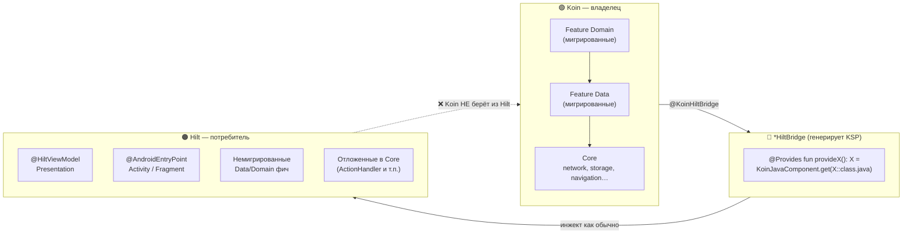
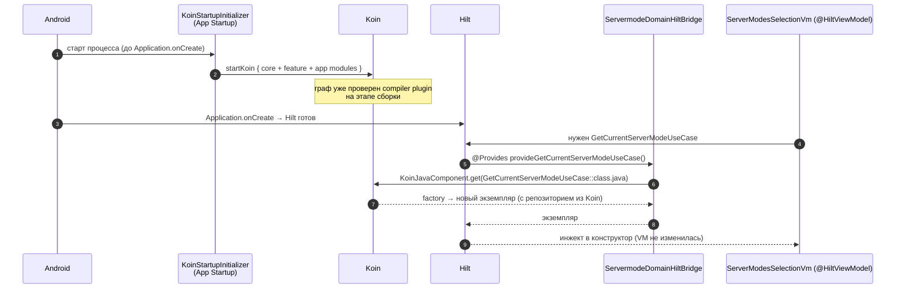
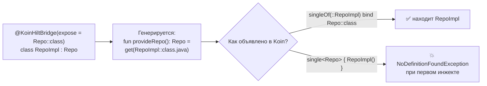
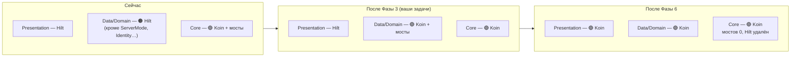

## 6. Как устроен гибридный граф (5 мин)

**Главная мысль:** в приложении сейчас два контейнера. Koin **владеет** мигрированными зависимостями, Hilt их только **одалживает** через мост. Зависимости передаются только в одну сторону: **Koin → Hilt**.

### 6.1. Общая картина



- Koin ничего не знает о Hilt. Hilt не знает, что объект пришёл из Koin.
- Объект существует **в одном экземпляре**: Hilt не создаёт свою копию, а получает объект из Koin.
- Обратного моста (Hilt → Koin) нет. Поэтому миграция идёт снизу вверх: Core → Data → Domain → Presentation.

### 6.2. Что происходит при старте и инжекте



Koin стартует через App Startup **раньше** любого Hilt-инжекта, поэтому к первому запросу из Hilt граф Koin уже есть.

### 6.3. Как это выглядит в коде (на примере ServerMode)

```kotlin
// domain — класс мигрирован: @Inject убран, мост поставлен
@KoinHiltBridge
class GetCurrentServerModeUseCase(
    private val repository: ServerModeRepository,
)

// domain/di — Koin владеет
val serverModeDomainModule = module {
    factoryOf(::GetCurrentServerModeUseCase)
}

// build/generated/ksp — генерируется сам, руками не трогаем
@Module @InstallIn(SingletonComponent::class)
object ServermodeDomainHiltBridge {
    @Provides
    fun provideGetCurrentServerModeUseCase(): GetCurrentServerModeUseCase =
        KoinJavaComponent.get(GetCurrentServerModeUseCase::class.java)
}

// presentation — НЕ трогаем, работает как раньше
@HiltViewModel
class ServerModesSelectionVm @Inject constructor(
    private val getCurrentServerModeUseCase: GetCurrentServerModeUseCase,
) : BaseVm<...>()
```

Это реальный формат: так выглядит `DomainHiltBridge` в `core-domain` (7 use cases) и `NavigationHiltBridge` в `core-navigation`.

### 6.4. Почему основной тип в Koin — класс, а не интерфейс



Hilt-потребитель получает тип `expose` (интерфейс). Сам мост при этом ищет в Koin **конкретный класс**.

### 6.5. Как граф меняется по ходу миграции



Мосты — **временные строительные леса**. Их число растёт в Фазе 3, падает в Фазах 4–5 и обнуляется в Фазе 6.

### 6.6. Кто ловит ошибки

| Где | Что проверяет | Что ловит |
|---|---|---|
| Компиляция модуля (Koin compiler plugin) | Koin-граф | Нет определения для зависимости в Koin |
| `:app:hiltJavaCompileGoogleDebug` (Dagger) | Hilt-граф и мосты | `MissingBinding` (нет моста / не тот `expose`), `DuplicateBindings` (остался `@Inject`/`@Binds`) |
| Запуск приложения | Связка мост → Koin | `NoDefinitionFoundException`: модуль не зарегистрирован в `FeatureDiModules`, `single<Iface>` вместо класса или feature-PR смержен без root-PR |

